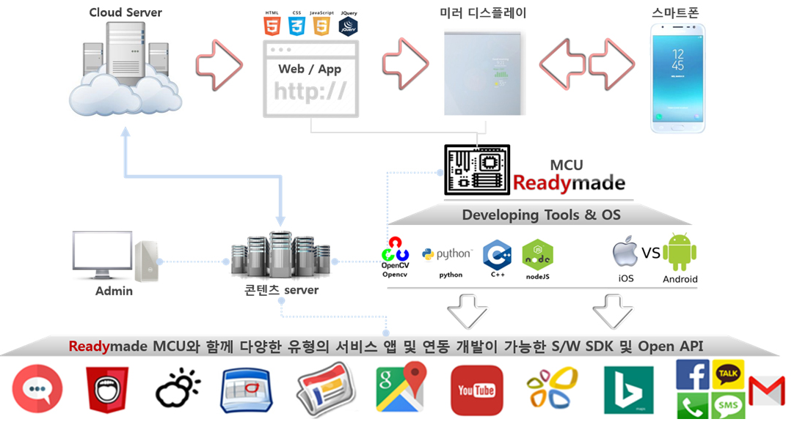

# embeddedsystem-project
> 임베디드시스템 설계

## 스마트 미러(smart mirror)
 - 일상 생활에서 사용하는 거울을 통해 인터페이스를 출력하거나, 여러가지 기능을 수행할 수 있는 IoT 디바이스
 - 스마트 미러는 자동차의 스마트 백미러에 처음 도입되었으며 이후 쇼핑, 피트니스, 의료 분야 등 다양한 분야에 접목됨

## 주제선정 및 목적
      주제: smart mirror 
      smart mirror 통해 날시예보, 달력, 각종 정보 등을 인터페이스에 출력하고 제어하며 얼굴 인식, 음성 인식 기능을 추가한다

- 임베디드시스템 설계 프로젝트에서 라즈베리파이를 이용한 smart mirror 제작하여 얼굴 인식(Deep-learning), 음성 인식 기술을 이용하여 날씨(Weather Forcast API), 달력(Google calendar), 지도(Google Map API) 등 정보를 제공을 목표로 함.

## smart mirror 작동 원리

## 준비물

## 1. 유리
- 스크린을 표시하기 위해 필요

## 2. 반사필름
- 반사된 유리에 필름을 부착하여 선명도와 가시성을 높이기 위해 필요

## 3. 유리 거치대
- 유리와 모니터 혹은 테블릿을 거치하기 위함

## 4. 라즈베리파이 및 모듈
- 라즈베리파이를 비롯한 usb hub, 각종 부품과 카메라 모듈

## 5. 모니터 혹은 테블릿pc
- 라즈베리파이로 부터 출력된 스크린을 표시하기 위해 필요
            
